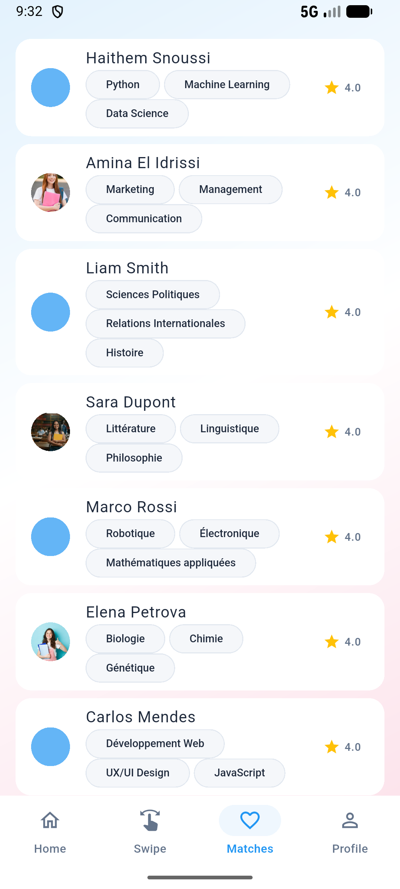
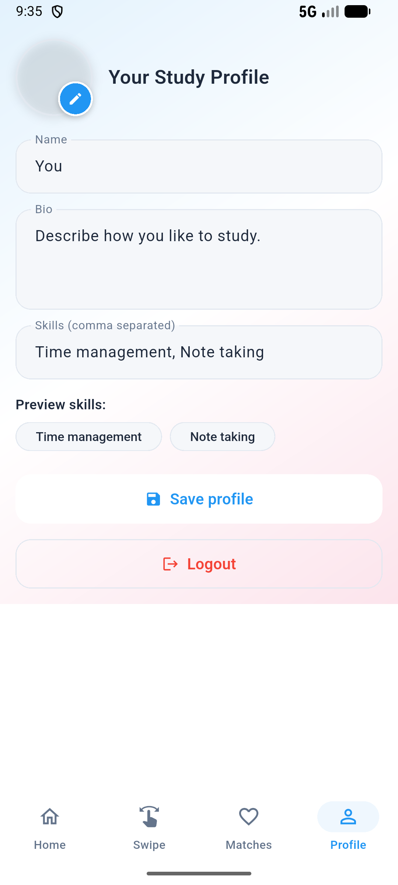
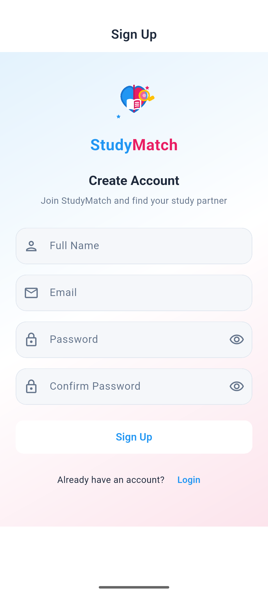

# Study Match

## Project Title and Description

**Study Match** is a mobile application built with Flutter that helps university students find compatible study partners. The app aims to match students who share subjects, study interests, and compatible availability. It is designed for students who want to form study groups, find partners for assignments, or arrange study sessions.

The main goal is to solve the problem of finding nearby or like-minded students for collaboration when social or academic connections are limited. The application provides a simple, swipe-based discovery interface and profile pages so users can evaluate potential matches quickly.

---

## Features

- **Swipe-based discovery** — Users can swipe right to like or left to pass on a candidate. (See: `SS/Swipe Page.png`)
- **Home dashboard** — Shows quick stats and featured profiles to get started. (See: `SS/Home Page.png`)
- **Matches list** — A central place to see mutual matches and start conversations. (See: `SS/Matches.png`)
- **User profile management** — Users can view and edit their profile, upload an avatar, and set subjects/interests. (See: `SS/Profile.png`)
- **Authentication screens** — Basic sign-up and login screens to create local user accounts. (See: `SS/Sighup.png`)
- **Local sample data** — The app ships with sample students in `assets/data/students.json` for demonstration and grading purposes.

User interactions are intentionally simple and consistent with common mobile patterns: sign up or log in, complete or edit a profile, use the home screen to access the swipe interface, and open the Matches screen to review mutual matches.

---

## Technologies Used

- Programming language: **Dart**
- Framework: **Flutter** (cross-platform UI)
- Packages (not exhaustive): `shared_preferences`, `http`, `image_picker`, `path_provider`
- Testing framework: `flutter_test`
- Tools: Git for version control, Flutter CLI for builds and running the app

---

## Project Structure

A high-level view of the repository layout and key files:

- `lib/` — Application source code
  - `main.dart` — App entry point
  - `app/` — Theming and app scaffolding (`app.dart`, `root_shell.dart`, `app_theme.dart`)
  - `core/` — Models and local state stores (`models/`, `stores/`)
  - `features/` — Feature directories for screens and widgets
    - `auth/` — Login and signup screens
    - `home/` — Home dashboard and widgets
    - `swipe/` — Swipe screen and card widgets
    - `matches/` — Matches screen
    - `profile/` — Profile screen and avatar upload widgets
- `assets/` — Static assets
  - `assets/data/students.json` — Sample data used for local testing
  - `assets/avatars/` — Avatar images used in demo data
- Platform dirs: `android/`, `ios/`, `web/`, `windows/`, `linux/`, `macos/`
- `test/` — Unit and widget tests

This layout supports separation of concerns, making it straightforward to evaluate individual features and to extend the app with server-side integration later.

---

## Screenshots

Below are the key screenshots included in the repository. Each screenshot demonstrates the current UI and behaviors used to evaluate the application.

### Home dashboard

<p align="center">
  
</p>

Caption: Main app dashboard showing quick stats and navigation to other features.

---

### Swipe interface

<p align="center">
  
</p>

Caption: Swipe-based discovery interface where users like or pass on profiles.

---

### Matches list

<p align="center">
  
</p>

Caption: List of mutual matches available to review and message.

---

### Profile page

<p align="center">
  
</p>

Caption: User profile view with avatar, subjects, and editable fields.

---

### Sign up screen

<p align="center">
  
</p>

Caption: Registration flow for creating a local user account.

(These images are included under the `SS/` folder in the repository; they reflect the actual UI and are referenced above for clarity.)

---

## Installation and Setup

Follow these steps to run the project locally for evaluation:

1. Clone the repository:

```bash
git clone <repository-url>
cd studymatch
```

2. Ensure you have Flutter installed and available on your PATH. See: https://docs.flutter.dev/get-started/install

3. Install dependencies:

```bash
flutter pub get
```

4. Run the app on a connected device or simulator/emulator:

```bash
flutter run
```

5. Run tests (unit/widget tests):

```bash
flutter test
```

Notes:
- The app uses only local sample data by default. No remote backend is required to evaluate the core functionality.
- If targeting iOS, open the `ios` project in Xcode to set signing options if required.

---

## Usage (Typical User Flow)

1. Open the app and sign up or log in via the authentication screens. (See: `SS/Sighup.png`)
2. Optionally, edit your profile (avatar, subjects, availability) from the Profile screen. (See: `SS/Profile.png`)
3. On the Home screen, access the Swipe interface and review suggested students. Swipe right to like, left to pass. (See: `SS/Swipe Page.png`)
4. Open the Matches screen to view mutual matches and initiate conversation or exchange details. (See: `SS/Matches.png`)

This flow demonstrates the primary evaluation scenarios used in grading: account creation, profile completion, discovery, and match handling.

---

## Future Improvements

Potential enhancements that would strengthen the project for further development or grading:

- Add a persistent backend (e.g., Firebase or REST API) for user accounts and real match persistence
- Implement real-time messaging between matched users
- Add filters and search for subjects, locations, and availability windows
- Improve accessibility and localization support
- Add integration and end-to-end tests and set up CI (GitHub Actions)
- Add analytics to observe feature usage and flows for future iterations

---

## Authors

Authors: [Haithem Snoussi & Fraj Ghrab]


